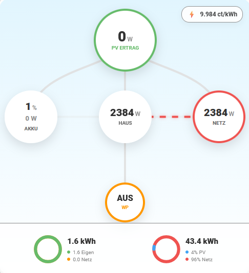
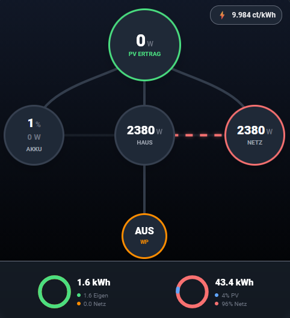

# Modern Solar Flow Card

| Light Mode | Dark Mode |
| --- | --- |
|  |  |

A modern, animated power flow card for Home Assistant, inspired by the FusionSolar design. It provides a beautiful visualization of your energy flows (Solar, Battery, Grid, Home, Heat Pump, and Water Storage).

## Features
- **Visual Editor**: Configure everything via the Home Assistant UI. No YAML required.
- **Animated Flows**: Real-time animation of energy directions with smooth, stutter-free updates.
- **Dynamic Autarky Ring**: A visual indicator around the home icon showing the current mix of self-produced vs. grid energy.
- **Integrated Icons**: Modern icons for all components (Solar, Battery, Home, Grid, Heat Pump, Boiler).
- **DHW Satellite**: Dedicated display for your hot water storage / boiler temperatures (supports up to two sensors).
- **Auto-Calculation**: Automatically calculates home consumption from available sensors (Solar + Grid + Battery).
- **Flexible Logic**: Inversion toggles for Grid, Battery, and Heat Pump sensors to match any hardware setup.
- **Theme Support**: Automatically adapts to Dark and Light modes with enhanced neon-glow effects.

## Color Logic

The card uses colors to indicate the source and status of your energy:

### Flow Lines (Animations)
- **Green**: Clean energy from Solar or Battery to Home, or from Home to Heat Pump (if no grid import).
- **Blue**: Energy flowing into the Battery (charging).
- **Red**: "Dirty" energy from the Grid to Home/Battery, or Home to Heat Pump (if grid import is active).

### Home Circle (Autarky Ring)
- **Green Part**: Percentage of consumption covered by self-produced energy (Solar/Battery).
- **Red Part**: Percentage of consumption currently supplied by the Grid.

### Component Status (Circle Borders)
- **Battery**: **Blue** (Charging), **Green** (Discharging).
- **Grid**: **Red** (Import), **Green** (Export/Feed-in).
- **Home**: Green (>90% Autarky), Orange (>30%), Red (<30%).
- **Solar**: **Green** (Producing), **Grey** (Inactive).
- **DHW**: **Red** (Heat indicator).

## Installation

### HACS (Recommended)
1. Go to **HACS** -> **Frontend**.
2. Click the three dots in the top right and select **Custom repositories**.
3. Add the URL `https://github.com/kitzi806/modern-solar-flow-card` and select **Lovelace** as the category.
4. Click **Install**.

## Configuration

The card is best configured using the UI editor.

| Name | Description |
| --- | --- |
| `solar_entity` | Entity providing current solar power (W). |
| `grid_entity` | Entity providing current grid power (W). |
| `use_home_calc` | If enabled, calculates home consumption automatically (Default: True). |
| `home_entity` | (Optional) Manually specify an entity for home consumption. |
| `battery_power_entity` | Entity providing current battery power (W). |
| `battery_entity` | Entity providing battery state of charge (%). |
| `wp_entity` | (Optional) Heat pump or extra load (supports sensors, switches, etc.). |
| `show_dhw` | Toggle visibility of the hot water storage (DHW) satellite. |
| `dhw_temp_top_entity` | DHW Temperature sensor for the top section. |
| `dhw_temp_bottom_entity` | DHW Temperature sensor for the bottom section. |
| `invert_grid` | Invert grid logic (Toggle if Export/Import are swapped). |
| `invert_battery` | Invert battery logic (Toggle if Charging/Discharging are swapped). |
| `invert_wp` | Invert heat pump logic (e.g. if Switch OFF = Active). |
| `price_entity` | (Optional) Current electricity price sensor. |
| `show_daily_stats` | Toggle visibility of the statistics footer. |

## Support
If you like this card, please give it a ⭐ on GitHub!
